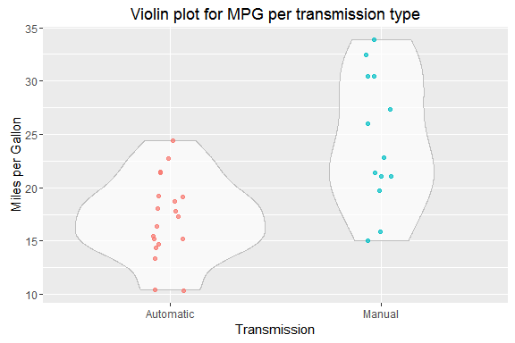
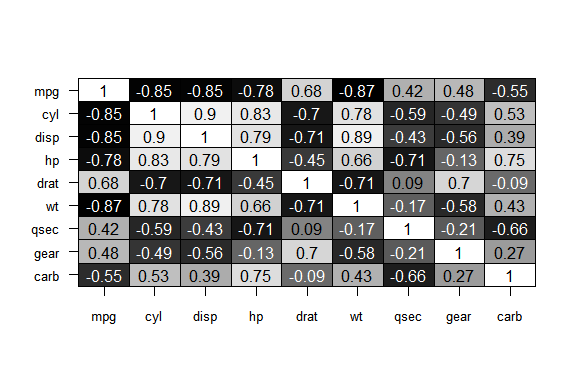
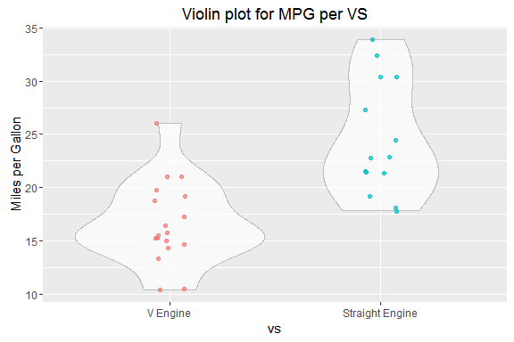
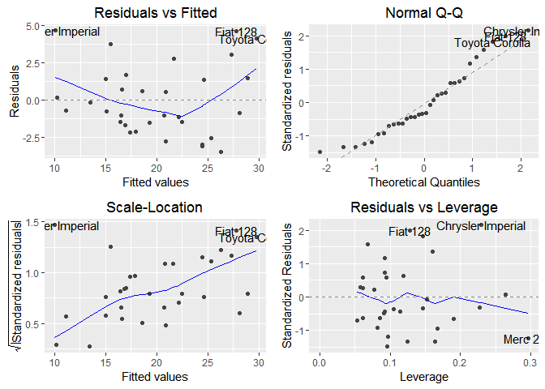

# Regression Models Course Project
Lefteris Nikolidakis  
Wednesday, July 23, 2014  

## Executive Summary
A study of automobile miles per gallon (MPG) performance was conducted for Motor Trend magazine. The objective of the study was to understand which automobile related factors had an effect on MPG performance and specifically, which type of transmission was better for MPG. The study utilized linear regression to explore the relationship between MPG and various other factors, including transmission. While initial univariate analysis of the data indicated that manual transmissions were better for MPG, a deeper multivariate regression analysis discovered that MPG was most highly correlated with weight and horsepower, while the choice of transmission was not a significant factor in determining MPG.

## Research Question
The goal of this study, was to explore the relationship between multiple variables related to automobile design and performance, and MPG. More specifically, we wanted to know which type of transmission, automatic or manual, was better for MPG?

## Data
The data used for this analysis was obtained from the 1974 _Motor Trend_ US magazine. The data set contained 11 variables (including MPG) describing various aspects of automobile design and performance for 32 automobiles (1973-74 models). 

Below is a description of each variable in the data set:

- `mpg`         Miles/(US) gallon 
- `cyl` Number of cylinders 
- `disp` Displacement (cu.in.) 
- `hp` Gross horsepower 
- `drat` Rear axle ratio 
- `wt` Weight (lb/1000)
- `qsec` 1/4 mile time 
- `vs`  V engine or a Straight engine (binary) 
- `am` Automatic or Manual Transmission (binary)
- `gear` Number of forward gears 
- `carb`	 Number of carburetors

Beloaw are the first 10 rows of the `mtcars` dataframe:

```
##                    mpg cyl disp  hp drat    wt  qsec vs am gear carb
## Mazda RX4         21.0   6  160 110 3.90 2.620 16.46  0  1    4    4
## Mazda RX4 Wag     21.0   6  160 110 3.90 2.875 17.02  0  1    4    4
## Datsun 710        22.8   4  108  93 3.85 2.320 18.61  1  1    4    1
## Hornet 4 Drive    21.4   6  258 110 3.08 3.215 19.44  1  0    3    1
## Hornet Sportabout 18.7   8  360 175 3.15 3.440 17.02  0  0    3    2
## Valiant           18.1   6  225 105 2.76 3.460 20.22  1  0    3    1
```


## Exploratory Analysis

To understand the relationship between the variables in the data set and MPG, some exploratory analysis of the data will be conducted. 

The Violin plot below clearly shows that there was a difference in MPG depending on transmission type. Automobiles with a manual transmission had a higher MPG than those with an automatic one. In fact, when looking at the data by transmission type, the average MPG for a manual transmission car was NA, while the MPG for an automatic transmission was an average of NA. 



The correlation matrix below shows the linear relationship between all variables with the two binary - `am` and `vs` excluded. 
`Mpg` was the most highly correlated with `weight` (-0.87), the number of `cylinders` (-0.85), `displacement` (-0.85), and `horsepower` (-0.78). These were all negative correlations, meaning they had a negative impact on MPG levels.

Also we notice strong lineral relationships between most of the explanatory variables. TO avoid collinearity these associations should be considered before fitting our multivariate model. 



Lastly the 2nd violin plot below illustrates the relationship between our variable of interest `mpg` and the binary  variable `vs`, suggesting that automobiles with V engines had a higher MPG than those with an Straight engine.




## Statistical Modeling

The exploratory analysis of the *Motor Trend* data showed that there is evidence to suggest that a linear relationship exists between automobile `MPG` and several variables in the data set, including transmission. 

To address the main research question of the relationship between `MPG` and `transmission` type, I run an independent 2-group t-test with MPG as the numeric variable and transmission as the binary factor. The p-value of the t-test is equal with  0.0013 and is below the critical value a = 0.05; also the t statistic is negative, therefore we conclude that the automobiles with maunual Transmission consume signicantly more gallons per mile on average than the automobiles with automatic Transmission.


```
## 
## 	Welch Two Sample t-test
## 
## data:  mpg by am
## t = -3.7671, df = 18.332, p-value = 0.001374
## alternative hypothesis: true difference in means is not equal to 0
## 95 percent confidence interval:
##  -11.280194  -3.209684
## sample estimates:
## mean in group Automatic    mean in group Manual 
##                17.14737                24.39231
```

### Multivariate Model selection with Backward-Elimination

For the analysis, we fit regression models to identify variables which are associated with mpg. We will use the stepwise selection method to retain significant variables in the multivariable regression model, and remove variables which are not.

We start with the full model including all potential predictor variables. However, instead of listing out the details of each step of eliminating variables with the largest p-values one by one, we let the software automatically do those steps and return us the best model, using the **step** function as below:


```r
fit <- lm(mpg ~ ., data=mtcars_test)
best_fit <- step(fit, direction="backward")
```
We then get a summary of the best model. We see that all of the variables remain have very low p-values (less than 0.05), and we cannot remove any more variables from this model. The *adjusted R-squared value* shows that this model can explain 83.36 percent of the variance in the response (mpg).


```
## 
## Call:
## lm(formula = mpg ~ wt + qsec + am, data = mtcars_test)
## 
## Residuals:
##     Min      1Q  Median      3Q     Max 
## -3.4811 -1.5555 -0.7257  1.4110  4.6610 
## 
## Coefficients:
##             Estimate Std. Error t value Pr(>|t|)    
## (Intercept)   9.6178     6.9596   1.382 0.177915    
## wt           -3.9165     0.7112  -5.507 6.95e-06 ***
## qsec          1.2259     0.2887   4.247 0.000216 ***
## amManual      2.9358     1.4109   2.081 0.046716 *  
## ---
## Signif. codes:  0 '***' 0.001 '**' 0.01 '*' 0.05 '.' 0.1 ' ' 1
## 
## Residual standard error: 2.459 on 28 degrees of freedom
## Multiple R-squared:  0.8497,	Adjusted R-squared:  0.8336 
## F-statistic: 52.75 on 3 and 28 DF,  p-value: 1.21e-11
```

The variance inflation factors (VIFs) below measure how much the variance (the square of the estimate's standard deviation) of each estimated regression coefficient is increased because of collinearity. Since all VIFs are quite low (less than 3), we are confident that none of the predictors in our fitted model are correlated with each other. 


```
##       wt     qsec       am 
## 2.482952 1.364339 2.541437
```

## Diagnositc Plots




